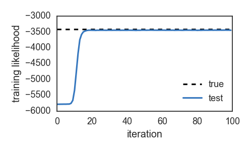

# PyLDS: Bayesian inference for linear dynamical systems

This package supports Bayesian inference via Gibbs sampling,
structured mean field, and expectation maximization (EM) for
dynamical systems with linear Gaussian state dynamics and
either linear Gaussian or count observations. For count data,
we support either Pólya-gamma augmentation or Laplace approximation.
These inference algorithms all benefit from fast
message passing code using Cython and BLAS.

```
pip install pylds
```

_Authors: Matt Johnson and Scott Linderman_

# Example
PyLDS exposes a variety of classes for working with linear
dynamical systems. For example, the following snippet will
generate synthetic data from a random model:
```python
import numpy.random as npr
from pylds.models import DefaultLDS

D_obs = 1       # Observed data dimension
D_latent = 2	# Latent state dimension
D_input = 0	# Exogenous input dimension
T = 2000  	# Number of time steps to simulate

true_model = DefaultLDS(D_obs, D_latent, D_input)
inputs = npr.randn(T, D_input)
data, stateseq = true_model.generate(T, inputs=inputs)

# Compute the log likelihood of the data with the true params
true_ll = true_model.log_likelihood() 
```
The `DefaultLDS` constructor initializes an LDS with a
random rotational dynamics matrix. The outputs are `data` -
a `T x D_obs` matrix - and `stateseq` - a `T x D_latent` matrix
of latent states. 

Now create another LDS and try to infer the latent states and
learn the parameters given the observed data. 

```python
# Create a separate model and add the observed data
test_model = DefaultLDS(D_obs, D_latent, D_input)
test_model.add_data(data)

# Run the Gibbs sampler
N_samples
def update(model):
    model.resample_model()
    return model.log_likelihood()

lls = [update(test_model) for _ in range(N_samples)]
```

We can plot the log likelihood over iterations to assess the
convergence of the sampling algorithm:

```python
# Plot the log likelihoods
plt.figure()
plt.plot([0, N_samples], true_ll * np.ones(2), '--k', label="true")
plt.plot(np.arange(N_samples), lls, color=colors[0], label="test")
plt.xlabel("iteration")
plt.ylabel("training likelihood")
plt.legend(loc="lower right")
```


We can also smooth the observations with the test model.
```python
# Smooth the data
smoothed_data = test_model.smooth(data, inputs)

plt.figure()
plt.plot(data, color=colors[0], lw=2, label="observed")
plt.plot(smoothed_data, color=colors[1], lw=1, label="smoothed")
plt.xlabel("Time")
plt.xlim(0, 500)
plt.ylabel("Smoothed Data")
plt.legend(loc="upper center", ncol=2)

```

Check out the [examples](/examples) directory for demos of other
types of inference, as well as examples of how to work with count
data and missing observations. 

# Installation
To install `pylds` from source, first clone the repo

    git clone git@github.com:mattjj/pylds.git
    cd pylds

Then install in developer mode:

    pip install -e .

Or use the standard install:

    python setup.py install

